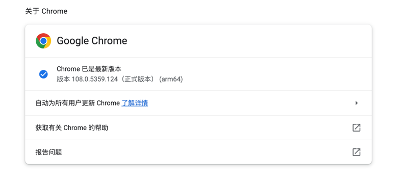
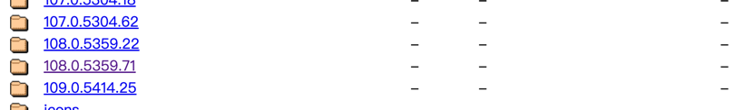
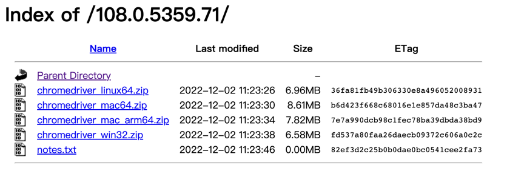
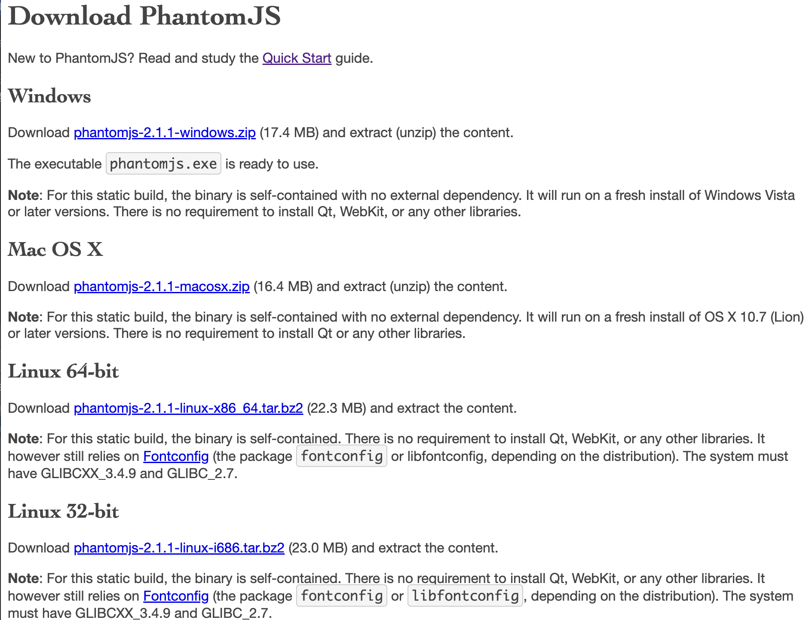

# 九寨沟每日旅游人数及气象信息爬虫
## 注意事项
### 此爬虫需要用到chromedriver，chromedriver的官网：
http://chromedriver.storage.googleapis.com/index.html
进去找到和Chrome版本一致的下载安装

### 此外，还需要安装phantomjs
可以在 http://phantomjs.org/download.html 中找到对应版本的安装

### 以上两个windows解压配置路径，linux、macos 放到usr/local/bin中

* tourism_num.py 爬取每日旅游人数
* weather_jiuzhaigou.py 爬取九寨沟天气信息
